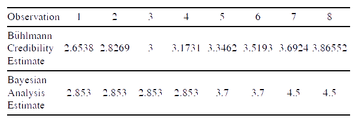

<style>
  div {border-radius: 10px; padding: 10px}
  div.red    {background-color:rgba(255, 0, 0, 0.2)}
  div.orange {background-color:#ffe0c7}
  div.yellow {background-color:#fff8c7}
  div.green  {background-color:#d7ffc7}
  div.blue   {background-color:#c7e9ff}
  div.purple {background-color:#e5c7ff}
</style>

$\newcommand{\vect}[1]{\boldsymbol{#1}}$
$\newcommand\given[1][]{\:#1\vert\:}$


```{r echo = FALSE}
library(rmarkdown)
```


# Useful Notation and Formulas

<div class = "red">

$$
  \Phi(x)= \text{N}(x)  =\Pr(Z \le x) \quad \text{ is the cumulative distribution for the unit normal}
$$

</div>

# 1: Introduction

- Credibility theory provides tools to deal with the randomness of data that is used for predicting future events or costs

<div class = "purple">

$$
  \textbf{Credibility-Weighted Estimate: } \\ \quad \text{Estimate } = Z \times [\text{Observation}] + (1-Z) \times [\text{Other Information}], \quad 0 \leq Z \leq 1 \\
$$

- $Z$ is called the ***credibility*** and $1-Z$ is generally referred to as the ***complement of credibility***

- If the body of the observed data is large, $Z$ will be close to $1$

- $\text{Other Information}$ represents an estimate or prior hypothesis of a rate to charge in the absence of the recent experience

</div>


# 2: Classical Credibility


## 2.1: Introduction


<div class = "blue">

- ***Full Credibility Criterion*** (or, ***Standard for Full Credibility***) is the minimum amount of data in order to set $Z=1$ in the credibility-weighted estimate above 

- If $Z<1$, we have a case of ***partial credibility***

</div> <br>

<div class = "green">

### Basic Concepts from Classical Credibility

1. How to determine the criterion for full credibility when estimating frequencies

2. How to determine the criterion for full credibility when estimating severities

3. How to determine the criterion for full credibility when estimating pure premiums

4. How to determine the amount of partial credibility to assign when one has less than that which is needed for full credibility


</div>

## 2.2: Full Credibility for Frequency

<div class = "yellow">

### Probability that a Poisson-distributed Variable is Within $\pm k$% of the Mean:

- Consider a random variable $X\sim \text{Pois}(n, \sqrt{n})$. 

- We can approximate $X$ with a normally-distributed variable with the same mean and variance given there are enough expected claims: $X' \sim \mathcal{N}(\mu = n, \sigma = \sqrt{n})$ 

- If we want to approximate the probability, $P$, that observation $X$ is within $\pm k$ of the mean, we get:

$$
  \begin{align}
    P &= \Pr(\mu - k \mu\leq X \leq \mu + k \mu) \\
      &= \Pr(-k\mu/\sigma \leq Z \le k\mu/\sigma) \\
      &= \Pr(-k\sqrt{n} \le Z \le k\sqrt{n}) \\
      &= \Pr(Z \le k\sqrt{n}) - \Pr(Z \le -k\sqrt{n}) \\
      &= \Phi(k\sqrt{n}) - \Phi(-k\sqrt{n}) \\
      &= \Phi(k\sqrt{n}) - (1 - \Phi(k\sqrt{n})  \\
      &= 2\cdot \Phi(k\sqrt{n}) - 1
  \end{align}
$$
<center>


</center>

</div><br>

<div class = "orange">

### Standard for Full Credibility of a Poisson-distributed Variable

- We want to know how many claims, $n$, are required for us to be able to say the observation is fully credible

- If $P$ and $k$ are known (constraints on how precise we require our observations to be in order to lend credence), we can use our formula from above to calculate $n=n_0$, the $\text{Standard for Full Credibility}$ is calculated as follows:

$$
  \begin{align}
    P &= 2 \cdot \Phi(k\sqrt{n}) - 1 \\ \\
    \textbf{Standard for Full Credibility (Poisson): } \quad n_0 &= \left(\dfrac{\Phi^{-1}\left( \dfrac{P+1}{2} \right)}{k} \right)^2 =\dfrac{y^2}{k^2}, \quad \left(\text{where } y = \Phi^{-1}\left(\dfrac{P+1}{2}\right)\right) 
  \end{align}
$$

<center>


</center>

- The value 1,082 claims $\left(P=90\%, k=5\%\right)$ is commonly used in applications

- Often $\pm2$ standard deviations $(P=95\%)$ is used

</div> <br>


<div class = "red">

### Variations from the Poisson Assumptions

- Occasionally, we will want to use a Binomial or Negative Binomial distribution rather than a Poisson distribution to estimate frequencies. This changes things, because, for these other distributions, the mean does not equal the variance

- We can derive a generalized formula for the $\text{Standard for Full Credibility}$ as follows:

$$
  \textbf{Standard for Full Credibility (Generalized): }  \quad n_0 = c \cdot \dfrac{y^2}{k^2}, \quad \quad \left(\text{where } c = \dfrac{\sigma_f^2}{\mu_f} \right)
$$

- *Note: $c=1$ in the Poisson case, $c=1-q$ in the Binomial case, $c=1+\beta$ in the Negative Binomial case*

</div> <br>

<div class = "purple">

### Exposures vs. Claims

- $\text{Standards for Full Credibility}$ are calculated in terms of the expected number of claims

- It is common to translate these into a number of exposures by dividing by the (appoximate) expected claim frequency (e.g., $n_0 = 1082 (P=90\%, k=5\%)$ and expected claim frequency is $0.04$ claims per house-year; hence, the $\text{Standard for Full Credibility}$ would be $1082/0.04\simeq 27,000$ house-years) 

- See ***Example 2.2.3*** on p. 11 for a demonstration of exposures and variation from Poisson assumptions

</div>


## 2.3: Full Credibility for Severity

<div class = "blue">

### Probability, $P$, that the Observed Severity, $S$, is $\pm k\%$ of the Mean

- The Classical Credibility ideas can also be applied to estimating claim severity, the average size of a claim

- Suppose a sample of $n$ claims, $x_1,x_2,\dots,x_n$ are each independently drawn from a loss distribution with mean, $\mu_s$, and variance, $\sigma_s^2$


- The observation mean of $S$: $\dfrac{x_1+x_2+\dots+x_n}{n} \simeq \mu_S$

- The observation standard deviation of $S$: $\dfrac{\sigma_S}{\sqrt{n}}$ 

- Hence, the probability that $S$ is within $\pm k\%$ of its mean can be determined as follows:

$$
  \begin{align}
    P &= \Pr(\mu_S-k\mu_S \le S \le \mu_S + k\mu_S) \\
      &= \Pr(-k\sqrt{n} \cdot (\mu_S/\sigma_S) \le Z \le k\sqrt{n} \cdot (\mu_S/\sigma_S) \\
      &= \Pr(Z \le k\sqrt{n} \cdot (\mu_S/\sigma_S)) - (1 - \Pr(Z \le k\sqrt{n} \cdot (\mu_S/\sigma_S))) \\
      &= 2 \cdot \Phi(k\sqrt{n} \cdot (\mu_S/\sigma_S)) - 1
  \end{align}
$$
</div> <br>

<div class = "green">

### Standard for Full Credibility for Severity

- In order to find the $\text{Standard for Full Credibility}$, we proceed as we had done for that of frequencies (i.e., by solving the above equation for $n$):

$$
  \begin{align}   
    P &= 2 \cdot \Phi(k\sqrt{n} \cdot (\mu_s/\sigma_s)) - 1 \\  \\
    \therefore n &= \left(\dfrac{\Phi^{-1}\left( \dfrac{P+1}{2} \right)}{k} \right)^2 \cdot\left( \dfrac{\sigma_S}{\mu_S} \right)^2 \\ \\
  \end{align}
$$
$$
  \textbf{Standard for Full Credibility for Severity: } \quad     n = n_0 \cdot CV_S^2
$$

- *Note: $n_0$ is the $\text{Standard for Full Credibility}$ for Frequency given $P$ and $k$, and the* ***coefficient of variation*** *$CV_S \equiv \dfrac{\sigma_S}{\mu_S}$*


</div>


## 2.4: Process Variance of L, PP, and LR

- Suppose that $n$ claims of size $x_1,x_2,\dots,x_n$ occur during the observation period

<div class = "yellow">

### Useful Quantities

$$
  \begin{align}
    \textbf{Aggregate Losses: } \quad L &= x_1+x_2+\dots+x_n \\ \\
    \textbf{Pure Premium: } \quad PP &= \dfrac{x_1+x_2+\dots+x_n}{\text{exposures}} = \dfrac{L}{\text{exposures}} = \text{frequency} \times \text{severity} \\ \\
    \textbf{Loss Ratio: } \quad LR &= \dfrac{x_1+x_2+\dots+x_n}{\text{earned premium}}
  \end{align}
$$

</div> <br>

<div class = "orange">

### Process Variance (of L, PP, or LR)

The variance of the observed pure premiums (or aggregate losses or loss ratio) for a given risk that occurs due to random fluctuations is referred to as the ***process variance***

<br>Let $\blacksquare = \text{pure premium|aggregate losses|loss ratio} = \text{PP|L|LR}$

#### Frequency and Severity not Independent

$$
  \textbf{Process Variance of  } \ \blacksquare \text{ : } \quad \sigma_{\blacksquare}^2 = \text{E}(\blacksquare^2) - \text{E}(\blacksquare)^2 
$$

- See ***Example 2.4.1*** 


#### Frequency and Severity are Independent

$$
  \begin{align}
    \textbf{Process Variance of } \ \blacksquare \text{: } \quad \sigma_{\blacksquare}^2 &= \mu_f \cdot \sigma_S^2 + \mu_S^2 \cdot \sigma_f^2 \\
    &= \mu_f \cdot  \text{E}(S^2)  \quad \quad \ \ \ \text{(Poisson frequency)}
  \end{align}
$$


#### Normal Approximation and $\text{Standard for Full Credibility}$ for $\text{L}$/$\text{PP}$/$\text{LR}$

- For large numbers of expected claims, the observed $\blacksquare$ are approximately normally distributed

- With this assumption, we can construct confidence intervals (e.g., there's a 95% chance $\blacksquare$ is within $\pm 10\%$ of its expected value) 

- Flipping the previous statement, we can determine Standards for Full Credibility for $\blacksquare$ (e.g., 3,645 claims are needed in order to have a 95% chance that $\blacksquare$ will be within $\pm 10\%$ of its expected value) using the same strategy as described in Section 2.2 and Section 2.3. This process is described in Section 2.5

</div>


## 2.5: Full Credibility for $\text{L}$, $\text{PP}$, and $\text{LR}$

- Because they are more difficult to estimate than frequencies, all other things being equal, the Standard for Full Credibility is larger for $\blacksquare$ than for frequencies

<div class = "red">

### Probability, $P$, that $\blacksquare$ is $\pm k\%$ of the Mean

Assuming the Normal Approximation, we have:

$$
  \begin{align}
  P &= \Pr(\mu_{\blacksquare} - k \mu_{\blacksquare} \le \blacksquare \le \mu_{\blacksquare} + k \mu_{\blacksquare}) \\
    &= \Pr(-k(\mu_{\blacksquare}/\sigma_{\blacksquare}) \le Z \le k(\mu_{\blacksquare}/\sigma_{\blacksquare})) \\
    &= 2 \cdot \Phi(k (\mu_\blacksquare/\sigma_\blacksquare)) - 1 \\ \\
  \therefore y &= k(\mu_\blacksquare/\sigma_\blacksquare) \quad \left(\text{where } y = \Phi^{-1}\left(\dfrac{P+1}{2}\right)\right)
  \end{align}
$$

</div> <br>

<div class = "purple">

### Standard for Full Credibility of $\blacksquare$


Now, ***assume that the frequency has a Poisson distribution***

Let $n_F$ be the expected number of claims for Full Credibility of $\blacksquare$. 

Then, $\mu_f = \sigma_f^2 = n_F$. Additionally, 

$$
  \begin{align}
    \mu_\blacksquare &= \mu_f \cdot \mu_S = n_F \cdot \mu_S \\
    \sigma_\blacksquare^2 &= \mu_f(\sigma_S^2 + \mu_S^2) = n_F(\sigma_S^2 + \mu_S^2)
  \end{align}
$$
Hence, we have:

$$
    y = k(\mu_\blacksquare/\sigma_\blacksquare) = k\left(\dfrac{n_F \cdot \mu_S}{\sqrt{n_F(\sigma_S^2 + \mu_S^2)}}\right)  
$$

$$
  \begin{align}
    \textbf{Standard for Full Credibility of } \ \blacksquare \textbf{ (Poisson) :} \quad \ n_F &= \dfrac{y^2}{k^2}\left(1+ \dfrac{\sigma_S^2}{\mu_S^2} \right) = n_0\left( 1 + CV_S^2 \right) \\ \\
    &= \text{Standard for Full Credibility of Frequency} \\
    & \quad \quad \quad \quad \quad \quad \quad \quad \quad \quad + \\
    & \text{ } \quad \text{Standard for Full Credibility of Severity}
  \end{align}
$$

*Note: $n_0 = \dfrac{y^2}{k^2}$ is the Standard for Full Credibility of Frequency and $CV_S = \dfrac{\sigma_S}{\mu_S}$ is the coefficient of variation of the severity as defined in previous sections*

</div> <br>

<div class = "blue">

#### Variations from the Poisson Assumption

- A more general formula for when the Poisson assumption does not apply:

$$
  \textbf{Standard for Full Credibility of } \  \blacksquare \text{ (Generalized): } \quad n_F = \dfrac{y^2}{k^2}\left( \dfrac{\sigma_f^2}{\mu_f} + \dfrac{\sigma_S^2}{\mu_S^2} \right) = n_0 \left( \dfrac{\sigma_f^2}{\mu_f} + CV_S^2  \right)
$$

</div>

## 2.6: Partial Credibility

- We've defined it to be the case that if the Standard for Full Credibility is met, $Z\equiv 1$, but how do we define $Z$ for partial credibility (i.e., if the Standard for Full Credibility is not met)?

<div class = "green">

Let $n_F$ be the Standard for Full Credibility for either frequency, severity, or pure premiums. Then, we can defined the credibility, $Z$, as follows:

$$
  \textbf{Credibility: } \quad Z = \begin{cases}
        1, & n \ge n_F \\
        \sqrt{\dfrac{n}{n_F}},    & n < n_F
      \end{cases}
$$

</div>


# 3: Least Squares Credibility

- ***Least Squares Credibility*** = ***Bühlmann Credibility*** = ***Greatest Accuracy Credibility***

- $Z = n/(n+k)$

- Bühlmann Credibility Parameter: $k$


## 3.1: Analysis of Variance

<div class = "yellow">

$$
  \textbf{Expected Value of the Process Variance (EPV): } \\ \text{E}_\theta\left[\text{Var}\left[X|\theta\right]\right] = \sum_{j} \Pr(\theta_j) \cdot \text{Var}[X|\theta_j]
$$

- $\text{EPV}$ is a weighted sum of the process variances for each type of risk

- $\theta_j$ might represent the types of dice (e.g., $\theta_1$ = a 6-sided die)


</div> <br>

<div class = "yellow">

$$
  \textbf{Variance of the Hypothetical Means (VHM): } \\ \text{Var}_\theta\left[\text{E}\left[X|\theta\right]\right] = \sum_{j} \Pr(\theta_j) \cdot \text{E}[X|\theta_j]^2 - \left( \sum_{j} \Pr(\theta_j) \cdot \text{E}[X|\theta_j] \right)^2
$$

</div><br>

<div class = "yellow">

$$
  \textbf{Total Variance} = \text{Var}[X] =\text{E}_\theta\left[\text{Var}\left[X|\theta\right]\right] + \text{Var}_\theta\left[\text{E}\left[X|\theta\right]\right] = \text{EPV} + \text{VHM}
$$

</div><br>

- <font color = "magenta">***A Series of Examples***</font> from p.43-48 is very insightful!


## 3.2: Bühlmann Credibility

<div class = "orange">

$$
  \begin{align}
    \textbf{Bühlmann Credibility Parameter: }& \quad k = \dfrac{\text{EPV}}{\text{VHM}} \\ \\
    \textbf{Bühlmann Credibility: }& \quad Z = \dfrac{n}{n+k}, \quad \text{(for } n \text{ observations)} \\ \\
      & \quad \ \ \ \ = \dfrac{\text{VHM}}{\text{Total Variance}}, \quad \text{(if } n=1)  
  \end{align}
$$


- *$\lim_\limits{n \to \infty} Z =1$*

- Compute $\text{EPV}$ and $\text{VHM}$ for a single observation, then plug into the formula for $\text{Bühlmann Credibility}$ with $n$ being the amount of observations

- If estimating claim frequencies or pure premiums, then $n$ is in exposures

- If estimating claim severities, then $n$ is in number of claims

- In general, $\text{Estimate(PP)} \ne \text{Estimate(Frequency)} \cdot \text{Estimate(Severity)}$

- <font color = "magenta">***A Series of Examples***</font> on p. 57-59 is insightful

</div>

### Assumptions Underlying $Z = n/(n+k)$

<div class = "red">

1. The complement of credibility is given to the overall mean

2. The credibility is determined as the slope of the weighted least squares line to the Bayesian Estimates

3. The risk parameters and risk process do not shift over times

4. The expected value of the process variance of the sum of $n$ observations increases as $n$. Therefore, the expected value of the process variance of the average of $n$ observations decreases as $1/n$

5. The variance of the hypothetical means of the sum of $n$ observations increases as $n^2$. Therefore, the variance of the hypothetical means of the average of $n$ observations is independent of $n$

</div>


## 3.3: Target Shooting Example

<div class = "purple">

- The average spread over the marksmen is the $\text{EPV}$

- The spread of the targets can be quantified as the $\text{VHM}$

- The number of shots we observe from the *same* unknown marksman is $n$ 

<center>


</center>

</div><br>

- In general, the $\text{Bühlmann Credibility}$ is a relative measure of the value of the information contained in the observation versus that in the a priori mean 

- In most applications of $\text{Bühlmann Credibility}$, the $\text{EPV}>0$ and $\text{VHM}<\infty$; hence, $k>0$

- In ordinary circumstances, $0<\text{Bühlmann Credibility}<1$


# 4: Bayesian Analysis

<div class = "blue">

- $\text{Bayesian Analysis}$ is another technique to update a prior hypothesis based on observations, closely related to the use of $\text{Bühlmann Credibility}$

- $\text{Bühlmann Credibility}$ is the least squares linear approximation to $\text{Bayesian Analysis}$

</div>

## 4.1: Mathematical Preliminaries

<div class = "green">

### Useful Definitions

$$
  \begin{align}
  \textbf{Conditional Probability: }& \quad\text{P}(A \given B) =  \dfrac{\text{P}(A \cap B)}{\text{P}(B)} \\ \\
  \textbf{Marginal Distribution Function: }& \quad \text{P}(B)  = \sum_i \ \text{P}(B \cap A_i) = \sum_i \ \text{P}(B \given A_i) \cdot \text{P}(A_i) \quad (\text{if }A_i \text{ disjoint})\\ \\
  \textbf{Conditional Distributions: } & \quad \text{P}(B \given A_i) \\ \\
  \textbf{Probabilities: } & \quad \text{P}(A_i) \\ \\
  \textbf{Posterior Probabilities: }& \quad \text{P}(\theta_i\given X = x)
  \end{align}
$$

</div><br>

<div class = "yellow">

### Conditional Expectation

In general, in order to compute a conditional expectation, we take the weighted average over all the possibilities, $x$:

$$
  \text{E}(X \given B) = \sum_x \ x \cdot \text{P}(X = x \given B)
$$

</div>


## 4.2: Bayesian Analysis

<div class = "orange">

$$
  \begin{align}
    \textbf{Bayes' Theorem: } \quad \text{P}(A_i \given B) &= \dfrac{\text{P}(B \given A_i) \cdot         \text{P}(A_i)}{\text{P}(B)} = \dfrac{\text{P}(B \given A_i) \cdot \text{P}(A_i)}{\sum_\limits j \text{P}(B \given A_j) \cdot \text{P}(A_j)} \\ \\
    \text{P}(A \given B) &= \dfrac{\text{P}(B \given A) \cdot \text{P}(A)}{\text{P}(B)}
  \end{align}
$$
$A_i$ represents a partition of $A$ (one of $A$'s disjoint subsets)

</div> <br>

<div class = "red">

### Posterior Estimates

$$
  \textbf{Posterior Estimate: } \quad \text{E}(X \given X = x) =\sum_i \ \text{P}(\theta_i \given X=x) \cdot \text{E}(X  \given \theta_i)
$$

- The $\text{Posterior Estimate}$ is sometimes called the $\text{Bayesian Estimate}$ or the $\text{Bayesian Posterior Estimate}$

- The result of $\text{Bayesian Analysis}$ (i.e., the $\text{Posterior Estimate}$) is always within the range of hypotheses 
  
  - e.g., $\text{P}(X \given \theta_1) = 0.3; \text{P}(X \given \theta_2) = 0.5$ $\rightarrow 0.3\le \text{E}(\text{P}(X) \given obs) \le 0.5$


</div><br>

<div class = "red">


$$
  \textbf{A Priori Mean: } \quad \text{E}(X) = \sum_i \  \text{P}(X = x_i) \cdot \text{E}(X \given X = x_i)
$$

- The sum of the product of the a priori chance of each outcome times its $\text{Posterior Estimate}$
is equal to the a prior mean

  - This is referred to as "the estimates being in balance"

</div>


### Relation of Bayesian Analysis and Bühlmann Credibility

- The $\text{Bühlmann Credibility Estimates}$ are the weighted least squares line fit to the $\text{Bayesian Estimates}$:

<div class = "purple">

<center>



</div><br> 

<div class = "purple">


</center>

</div>


## 4.3: Continuous Prior and Posterior Distributions

<div class = "blue">

Let $X$ and $Y$ be two random variables. Then, 

$$
  \begin{align}
    \textbf{Joint p.d.f: }& \quad f(x,y) \\ \\
    \textbf{Marginal p.d.f's: }& \quad f_X (x) = \int_{-\infty}^\infty f(x,y) \ dy  \\ \\
    \textbf{Conditional p.d.f for } X \textbf{ given } Y \textbf{: }& \quad f_X(x \given y) = \dfrac{f(x,y)}{f_Y(y)} \\ \\
  \end{align}
$$


</div> <br>

<div class = "green">

In insurance applications, it is common for there to be two variables of interest, with one being discrete and the other being continuous. Let $X$ be discrete (it may represent number of claims) and $\theta$ be a parameter of the distribution of $X$. Then,

$$
  f(x,\theta) = f_X(x \given \theta) \cdot f_\Theta(\theta)
$$

- $f_\theta(\theta)$ is the ***prior distribution*** of $\theta$ (it's the marginal p.d.f of $\Theta$). It may represent our initial guess about the distribution of some characteristic within a population (e.g., expected claim frequency)

</div><br>

<div class = "green">

Combining the preceeding joing p.d.f equation with the conditional p.d.f equation from the sub-section above, we have:

$$
  f_\Theta(\theta \given x) = \dfrac{f_X(x \given \theta) \cdot f_\Theta(\theta)}{f_X(x)}
$$

- $f_\Theta(\theta \given x)$ is the ***posterior distribution*** of $\Theta$ for the selected risk (i.e., for $X = x$)

</div> <br>

<div class = "yellow">

$$
  \textbf{Conditional Expectation: } \quad \text{E}(X \given Y) = \int_{-\infty}^\infty \ x \cdot f_X(x \given y) \ dx
$$

</div> <br>

<div class = "yellow">

$$
  \textbf{Expectation of } X \textbf{: } \quad \text{E}(X) = \text{E}_Y(\text{E}_X(X \given Y)) = \int_{-\infty}^\infty \left[ \int_{-\infty}^\infty  \ x \cdot f_X(x \given y) \ dx \right] \cdot f_Y(y) \ dy
$$

</div> <br>

- Review <font color = "magenta">***Examples 4.3.1-3***</font>


# 5: Conjugate Priors


- A study of the $\text{Gamma-Poisson}$ conjugate prior distribution is of particular value for casualty actuarial work


## 5.1: Gamma Function and Distribution

<div class = "orange">

$$
  \begin{align}
  \textbf{Gamma Function: } \quad \Gamma(\alpha) &= \int_{t=0}^\infty t^{\alpha-1} \cdot e^{-t} \ dt = \lambda^\alpha \cdot \int_{t=0}^\infty t^{\alpha-1} \cdot e^{-\lambda t} \ dt \quad \text{for} \ \ \ \alpha \ge 0, \quad \lambda \ge 0 \\ \\
    &= (\alpha-1) \cdot \Gamma(\alpha-1) \\ \\
    &= (\alpha-1)! \quad \quad \quad \quad \quad \quad \text{for } \alpha \in \mathbb{N}
  \end{align}
$$

</div> <br>

<div class = "orange">

Integral involving $e^{-x}$ and powers of $x$ can be written in terms of the $\text{Gamma}$ function:

$$
  \int_{t=0}^\infty t^{\alpha-1} \cdot e^{-\lambda t} \ dt = \Gamma(\alpha) \cdot \lambda^{-\alpha}
$$


</div>


## 5.2: The Gamma-Poisson Model

<div class = "red">

- The $\text{Gamma-Poisson}$ model has two components:
  1. a $\text{Poisson}$ distribution which models the number of claims for an insured with a given claims frequency
  2. a $\text{Gamma}$ distribution to model the distribution of claim frequencies within a population of insureds      

</div><br>

<div class = "purple">

### Poisson Distribution

The probability of having $n$ claims in a year is given by:

$$
  \begin{align}
  \Pr(n \given \mu) &= \dfrac{\mu^n \cdot e^{-\mu}}{n!}, \quad \text{where } \mu \text{ is the mean annual claims} \\ \\
  \text{E}(n) &= \mu
  \end{align}
$$

</div><br>

<div class = "blue">

### Gamma Distribution 

The mean claim frequencies for insureds within the population are assumed to be $\text{Gamma}$ distributed with probability density function:

$$
  \textbf{Prior Distribution of Mean Claim Frequencies: } \quad \\f(\mu) = \dfrac{\lambda \cdot \mu^{\alpha-1} \cdot e^{-\lambda\mu}}{\Gamma(\alpha)}, \quad \text{for } \quad \mu>0 \quad \text{and} \quad \alpha,\lambda>0
$$

$$
  \begin{align}
    \textbf{Mean: }& \quad \text{E}(\mu) = \dfrac{\alpha}{\lambda} \\ \\
    \textbf{Variance: }& \quad \text{Var}(\mu) = \dfrac{\alpha}{\lambda^2}
  \end{align}
$$


</div> <br>

<div class = "green">


### Mixed Distribution

Suppose that an insured is selected at random from the population of insureds. What is the distribution of the number of claims for the insured? Equivalently, what is the probability that you will see exactly $n$ claims in the next time period?

- We need to calculate a weighted average of the $\text{P}(n \given \mu)$'s


$$
  \begin{align}
    \textbf{Gamma-Poisson Mixed Distribution: } \quad g(n) &= \int_{0}^\infty \text{P}(n \given \mu) \cdot f(\mu) \ d\mu \\ \\
 &= {n + \alpha - 1 \choose n} \cdot p^{\alpha} \cdot (1-p)^{n}, \quad \left(\text{with  } \ \ k=\alpha, \ \  p = \dfrac{\lambda}{\lambda+1}\right)
  \end{align}
$$

$$
  \begin{align}
    \textbf{Mean: }& \quad \dfrac{k(1-p)}{p} = \dfrac{\alpha}{\lambda} \\
    \textbf{Variance: }& \quad \dfrac{k(1-p)}{p^2} = \dfrac{\alpha(\lambda+1)}{\lambda^2}
  \end{align}
$$

- This is a $\text{Negative Binomial}$ distribution with $k=\alpha$ and $p= \dfrac{\lambda}{\lambda+1}$! 


</div>


## 5.3: Bayesian Analysis on the Gamma-Poisson Model

<div class = "yellow">

The $\text{Gamma}$ p.d.f $f(\mu)$ defined in Section 5.2 is the ***prior distribution*** for the mean annual claims frequency $\mu$ for a risk selected at random from the population. But the p.d.f can be updated using $\text{Bayesian Analysis}$ after observing the insured. The distribution of $\mu$ subsequent to observations is referred to as the ***posterior distribution***

Suppose that the insured generates $C$ claims during a $Y$-year (or, $Y$-exposure) observation period. We want to calculate the posterior distribution for $\mu$ given this information:

$$
  \begin{align}
    \textbf{Posterior Distribution: } \quad f(\mu \given n = C \text{ in } Y\text{ years}) &= \dfrac{\text{P}(C \given \mu) \cdot f(\mu)}{\text{P}(C)} \\ \\
    &= \dfrac{(\lambda+Y)^{\alpha+C} \mu^{\alpha+C-1} e^{-(\lambda+Y)\mu}}{\Gamma(\alpha + C)} \\ \\ 
    &= \dfrac{\lambda'^{\alpha'} \mu^{\alpha'-1} e^{-\lambda' \mu}}{\Gamma(\alpha')}, \quad \left( \alpha' = \alpha+C, \quad \lambda' = \lambda+Y \right)
  \end{align}
$$

$$
  \begin{align}
    \textbf{Mean: }& \quad \text{E}(\mu \given n = C \text{ in } Y\text{ years}) = \dfrac{\alpha'}{\lambda'} = \dfrac{\alpha + C}{\lambda + Y} \\ \\
    \textbf{Variance: }& \quad \text{Var}(\mu \given n = C \text{ in } Y\text{ years}) = \dfrac{\alpha'}{\lambda'^2} = \dfrac{\alpha +C}{(\lambda + Y)^2}
  \end{align}
$$

- The posterior distribution takes the form of a $\text{Gamma}$ distribution

- Because the prior and posterior distributions have the same form ($\text{Gamma}$, in this case), we call the $\text{Gamma}$ distribution a ***Conjugate Prior Distribution*** for the $\text{Poisson}$ 

</div><br>

<center>


</center>


<div class = "orange">

### Predictive Distribution

- The posterior mixed distribution is called the ***predictive distribution***

- Since the posterior distribution described above is still $\text{Gamma}$-distributed, the posterior of the mixed distribution remains the same form as the mixed distribution ($\text{Negative Binomial}$), but the parameters change:

$$
  \begin{align}
  \textbf{Predictive Distribution: } \quad g(n \given n = C \text{ in } Y \text{ years}) &= {n + \alpha' - 1 \choose n} \cdot p'^{\alpha'} \cdot (1-p')^{n}, \\ \\ with   \quad k' &=\alpha' = \alpha + C \\ \  p' &= \dfrac{\lambda + Y}{\lambda+1+Y}
  \end{align}
$$

$$
  \begin{align}
    \textbf{Mean: }& \quad \dfrac{k'(1-p')}{p'} = \dfrac{\alpha +C}{\lambda + Y} \\ \\
    \textbf{Variance: }& \quad \dfrac{k'(1-p')}{p'^2} = \dfrac{(\alpha + C)(\lambda+1 + Y)}{(\lambda + Y)^2}
  \end{align}
$$

</div>

<center>


</center>

## 5.4: Bühlmann Credibility in the Gamma-Poisson Model

As in section 5.3, an insured is selected at random from a population with a $\text{Gamma}$ distribution of average annual frequencies.

Using $\text{Bühlmann Credibility}$, we want to estimate the expected annual claims frequency. 

To do this, we need to calculate the $\text{Expected Value}$ of the $\text{EPV}$ and the $\text{VHM}$:

<div class = "red">

### Expected Value of the Process Variance

$$
  \textbf{EPV} = \text{E(Process Variance)} = \text{E(Mean)} = \text{E}(\mu) = \dfrac{\alpha}{\lambda}
$$

</div> <br>

<div class = "red">

### Variance of Hypothetical Means

$$
  \textbf{VHM} = \text{Var}(\mu) = \dfrac{\alpha}{\lambda^2}
$$

</div><br>

<div class = "red">

### Bühlmann Credibility Parameter

$$
  \textbf{k} = \dfrac{\text{EPV}}{\text{VHM}} = \dfrac{\dfrac{\alpha}{\lambda}}{\dfrac{\alpha}{\lambda^2}} = \lambda
$$
</div><br>

<div class = "purple">


#### Calculating the Credibility-Weighted Estimate of Average Annual Claims Frequency

An insured is selected at random from a population of insureds whose average annual claims frequencies follow a $\text{Gamma}$ distribution with parameters $\alpha$ and $\lambda$.

Over the next $Y$ years, the insured is observed to have $n$ claims. 

<br>

The $\text{Credibility-Weighted Estimate}$ of the average annual claims frequency for the insured is calculated as follows:

1. The observed annual claims frequency is $\dfrac{n}{Y}$

2. The credibility of the $Y$ years of observations is: $Z = \dfrac{Y}{Y+k} = \dfrac{Y}{Y+\lambda}$

3. The prior hypothesis of the claims frequency is the mean of $\mu$ over the population: $\text{E}(\mu) = \dfrac{\alpha}{\lambda}$

4. The $\text{Credibility-Weighted Estimate}$ is:

$$  
  \begin{align}
    \textbf{Estimate} &=  Z \cdot \dfrac{n}{Y} + (1-Z) \cdot \dfrac{\alpha}{\lambda} \\
    &= \dfrac{Y}{Y+\lambda} \cdot \dfrac{n}{Y} + \left(1 - \dfrac{Y}{Y+\lambda} \right) \cdot \dfrac{\alpha}{\lambda} \\
    &= \dfrac{n}{Y+\lambda} + \dfrac{\lambda}{Y+\lambda} \cdot \dfrac{\alpha}{\lambda} \\ \\
    &= \dfrac{\alpha+n}{\lambda+Y}
  \end{align}
$$


- The is *exactly* equal to the mean of the posterior $\text{Gamma}$ distribution

- For the $\text{Gamma-Poisson}$, the estimates from using $\text{Bayesian Analysis}$ and $\text{Bühlmann Credibility}$ are equal

</div>


