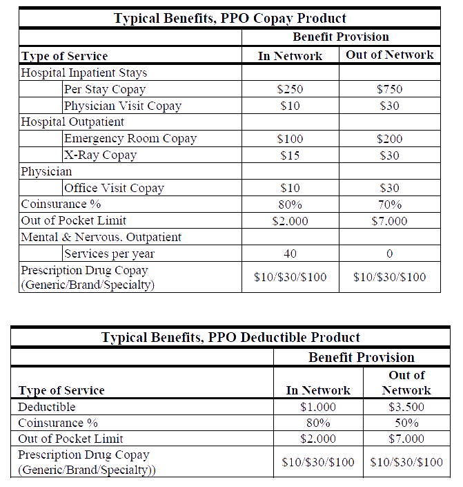

# Major Medical Coverage

- Major medical coverage was introduced around 1950, when it was observed that simple coverage of only hospital costs did not adequately protect policyholders.

- ***Major medical coverage*** = hospital + physician + ancillary 

- The list of health care expenditures that a policy covers are called ***covered services*** (a.k.a. ***covered expenses***).

- Allocating some portion of the covered expense to the insured is often deemed to be good design, because it still provides some (albeit watered down) financial incentive to the insured to control costs. The portion of costs allocated to the insured is called ***cost sharing***.

## Deductibles

- A ***deductible*** is a dollar amount, specified in the policy, for which the insured is responsible before any benefits are payable.

- Deductibles can apply to all services under the contract, or a subset of the services

- ***Billed charges*** is the un-discounted charge the physician puts on the bill

- If the physician is participating in the insurer's network, they might lower the billed charges, asking only for the ***allowed charges*** (e.g., $1000 -> $700, if in network)

  - In this case, the insured pays the deductible as usual, and the insurer saves some dough on the discounted benefit 

## Coinsurance

- It is common in major medical plans that, once the deductible is satisfied, benefits above that amount are payable at a percentage (typically 75%-90%, the most common being 80%) of covered expenses.

- ***Co-insurance*** is the percentage payable by the insurer (the ~80%) [confusingly, some people call the ~20% co-insurance]

- The insured's cost-sharing is the remaining percentage

- Example: $1000 billed charges -> $700 allowed  charges, with a $100 deductible, with policy paying 80%... Insured pays the first $100, then 20% of the remaining $600, for a total of $220. Insurer covers the other $480.

- The practice of seeking payment from the insured for the excess of billed charges over allowed charges is known as ***balance billing*** (but most provider contracts require that this not be done)

## Out-of-Pocket Limits

- An ***out-of-pocket provision*** or ***stop-loss provision*** is put in place to limit the payment from the insured.

- Lots of ways to set up this provision: could include or exclude deductible, different for each member of a family plan

## Maximum Limits

- There can be maximums on how much the insurer will cover. These limits used to be really low, but now medicine is very expensive and the maximum limits can be in the millions of dollars.

- Many plans have eliminated these maximums, but there's been a resurgence in them as insured view a "$5 million maximum" more favorably than an unlimited maximum.

- Even though an insured reaches a maximum on a lifetime policy, there might be a small benefit reinstatement of, for instance, $50,000 each year, to allow for modest coverage in the event of a catastrophic injury.

- Under the ACA, major medical policies (grandfathered or not) can no longer have lifetime dollar limits on covered services deemed to be “essential health benefits.”

## Internal Limits

- ***Internal limits*** are limits on certain subsets of benefits (e.g., mental, substance abuse, etc.) for a given policy.

- These limits could be in terms of dollars or number of visits.

- The ACA prevention of lifetime dollar limits on essential health benefits caused a lot of insurers to replace dollar limits on particular services with limits on number of visits

## Co-pays

- Cost-sharing that occurs each time a service is provided is called a ***co-pay***.

- These payments often included physician office visits ($20 each visit, for instance) and ***tiered*** ($10 for generic, $20 for brand name) payments for prescription drugs.

- HMO's tend to use co-pays rather than deductibles for cost-sharing.

- The administration of prescription drug benefits are typically outsourced to a ***pharmacy benefits manager (PBM)***.

- Eligibility for prescription benefits and the determination of benefits typically occur at the time the prescription is filled, and requires access to benefit information to determine cost sharing, so that the pharmacy can collect it at that time.

- Since PBM's don't have access to insurer benefit and claim information, there is a compelling argument to use co-pays with prescription drugs, rather than deductibles.

## Variations on a Theme - Related Products

### Comprehensive Major Medical Coverage

- Major medical had high deductibles back in the day, but, over time, a new version of major medical coverage, called ***comprehensive major medical (CMM)***, emerged.

- CMM involves smaller deductibles along the lines of $50-$100.

- Some carriers (particularly, commercial carriers) allow insureds to pick and choose options that are best for them.

### Catastrophic Medical

- ***Catastrophic major medical*** is a variation of major medical whose purpose is to protect from the opposite risk addressed by CMM coverage: namely, it's coverage with very high (~$25k-$100k) deductibles.

- ACA caps out-of-pocket maximums, so this effectively prohibits catastrophic major medical products from existing.

### Short-term Medical

- A lot of people only utilized major medical for a short period of time, and it led to losses on the side of the insurers.

- To combat this, ***short-term medical*** products were developed, often with single limited terms of 3-12 months.

- Often included pre-existing condition exclusion.

- These policies appear to be largely exempt from the reforms introduced by the ACA, since ACA required most individuals to maintain coverage throughout the year.

### High-risk Pool Plans

- State high-risk pool contracts set up by ACA in the early 2010s varied by state, but most were approximately: 80% co-insurance major medical, choice of deductible, max @ $350k-$2m.

### Consumer-directed Plans

- A ***consumer directed plan*** is typically characterized by a high deductible major medical (or HMO) plan, combined with an underlying ***personal spending account***.

- The intent is that the insured will take emotional ownership of the assets in this personal account, and will be motivated to use the money efficiently.

#### Medical Savings Accounts

- ***Medical Savings Accounts*** are accounts created by Congress in 1997 as a demonstration project for small group and self-employed insureds.

- Contributions to the account are made pre-tax (being at least tax deferred), and the earnings on the account are also tax deferred.

- At age 65, it's basically an IRA: can withdraw funds, but it's taxable.

- No new MSA accounts can be opened today.

#### Health Savings Accounts

- ***Health Savings Accounts (HSAs)*** were created in 2003.

- Available to individuals and employers, but the insured must be covered under a ***High Deductible Health Plan (HDHP)*** (e.g., not Medicare).

- Account owned and maintained by the insured, with contributions pre-tax and interest pre-tax.

## ACA Restrictions on Plan Design

- ACA places a wide variety of restrictions on benefit plan design (w.r.t. covered services and cost sharing)

- ACA mandates all individuals purchase health insurance.

- The regulation sought to partially standardize the coverage.

### Essential Health Benefits

ACA says: all non-grandfathered individual and small group major medical plans must cover the following ***essential health benefits (EHBs)*** starting in 2014:

1. Ambulatory patient services;

2. emergency services;

3. hospitalization;

4. maternity and newborn care;

5. mental health and substance use disorder services, including behavioral
health treatment;

6. prescription drugs;

7. rehabilitative and habilitative services and devices;

8. laboratory services;

9. preventive and wellness services and chronic disease management;
and

10. pediatric services, including oral and vision care.

Inclusion of habilitative services and pediatric vision and oral care has caused the most difficulties for insurers, but the government has since made it easier for insurers with separate standalone plans for these services.

### Actuarial Values, Metal Levels, and Cost Sharing Limits

- Actuarial value (AV) and cost sharing limit requirements set boundaries on the types and levels of cost sharing insurers may impose on members for those services

- ***Actuarial value*** is the percentage of total claim costs for the plan that are expected to be paid by the insurer.

- All insurers must use the Actuarial Value Calculator (AVC) to measure this benchmark, or obtain certification from an actuary.

- All ACA-compliant plans sold after January 1, 2014 must meet an AV ***metal level*** (platinum, gold, silver, and bronze), whereby each metal level has a set range of allowable AVs (e.g., platinum means the insurers pays a very high percentage of the costs).

### Other Requirements

Plans that are to be certified for sale on a public Exchange must also meet a variety of other market rules. These include:

-  Passing a meaningful difference test (to prevent insurers from monopolizing virtual “shelf space” with many very similar plans);

- Network adequacy tests;

- Tests for discriminatory service areas;

- Tests for discriminatory cost sharing; and

- Tests by the government for “outlier” premium rates.

## Networks

- A ***provider network*** is a collection of doctors, hospitals, and other providers, who have agreed to provide certain services for insureds of the insurer.

- In return, the network is provided with a stream of patients and are paid according to the contracts.

- When it is not feasible or desirable for an insurer to build a proprietary network, the other alternative usually pursued is to contract with existing ***networks for hire***.

- Networks for hire are usually created by non-insurance companies who have invested the resources necessary to create their own networks, with the intent of renting the network to insurers.

### PPO Products

- The class of products which utilize networks are generally referred to as ***Preferred Provider Organization (PPO)*** products

- These products have two tiers: in-network, and out-of-network, with in-network being much cheaper, in most cases:

- It is fairly common to have in-network benefits structured as a co-pay benefit, but out-of-network benefits structured as a deductible benefit.

### Measuring and Choosing Providers

- Insurers who are building their own networks must choose which providers to include in their networks.

- How restrictive? Only providers who meet very strict criteria; or, all providers in the area.

- Some insurers have developed multiple networks, with different levels of breadth and discount.

- In many areas, health-care providers have consolidated into a few large systems, which often cannot be split up when building a network.

- Common criteria used: quality measures, efficiency of care, adherence to treatment standards, cost, etc.)

### Measuring and Choosing Networks

- Insurers who rent networks today typically evaluate those networks mostly on the cost savings through provider discounts achieved by the network.

# Dental Coverage

- Dental insurance is most typically a group coverage.

- Dental benefits can be defined as either a scheduled amount per service (according to a specified schedule) or as a percentage of allowed charges.

- Four types of benefits:

  1. Type I: Diagnostic
  
  2. Type II: Basic Services
  
  3. Type III: Prosthetic Coverage

  4. Type IV: Orthodontia

- Type IV often absent in individual product plan designs.

## Multiple Treatment Options

- Often, there are a number of different treatment options for dental issue, including waiting before beginning treatment. These options can have vastly different costs.

- Sometimes ***pre-authorization***, or approval by the insurer, is required before dental services can be administered.

## Accumulated Untreated Conditions

- Common for patients to postpone dental procedures to be sure they are covered by insurance. One way to limit these difficulties for insurers is to try to restrict coverage on pre-existing conditions, sometimes achieving this by reducing initial benefits.

## External Anti-selection 

- Most individuals have a pretty good self-perception of their own dental health, and often they are aware of specific needs for treatment. 

- Because of this, individual dental coverage is very susceptible to anti-selection by prospective insureds, who will self-select their coverage if it is worthwhile for them to do so. 

- This requires aggressive management, aimed at limiting that potential, as anti-selection can increase overall claim costs for small employers groups by as much as 30%, or more.

## Pediatric Dental Coverage Under the ACA

- Similar to the actuarial value rules described earlier, pediatric dental plans must meet certain benefit standards prescribed by regulation in order to be sold on the exchanges.

